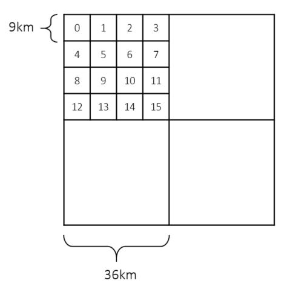

##  A multiscale deep learning model for soil moisture integrating satellite and in-situ data


### Installation 
 
This repository was written and tested for **Python 3.7**, **CUDA 10.1**, and **Pytorch 1.7.1**. It can be run in linux or the user needs to create the environment manually.
As the data is large, you need to download it from [here](https://doi.org/10.5281/zenodo.6314345).
```
unzip hydroDL_zenodo.zip
cd hydroDL_zenodo
conda env create -f hydroDL-rel.yml python==3.7 
conda activate hydroDL-rel 
pip install torch==1.7.1+cu101 torchvision==0.8.2+cu101 torchaudio==0.7.2 -f https://download.pytorch.org/whl/torch_stable.html
(linux): wget https://data.pyg.org/whl/torch-1.7.0%2Bcu101/torch_scatter-2.0.7-cp37-cp37m-linux_x86_64.whl
(linux): pip install ./torch_scatter-2.0.7-cp37-cp37m-linux_x86_64.whl
(windows): wget https://data.pyg.org/whl/torch-1.7.0%2Bcu101/torch_scatter-2.0.7-cp37-cp37m-win_amd64.whl
(windows): pip install ./torch_scatter-2.0.7-cp37-cp37m-win_amd64.whl
```

### Dataset Setup 
 
The tutorial includes demo data located in `./example/multiscale/`, which contains three folders `fine_resolution`, `coarse_resolution`, and `insitu`. 
 
##### How to match coarse-resolution with fine-resolution data : 

coarse-resolution and fine-resolution data are matched by `index_bsf_fsg.json`, which is as follows: 

`[[0,1,2...,15], [16, 17,18,…,31],...] `



The position of each sub-list corresponds to the index of the coarse cell, and the content of the sub-list corresponds to the index of the fine resolution data contained in the coarse cell. 
A part of the data can be selected for training if the data is too large. The method is to pick the index of the coarse grid (e.g.`[0, 2, 3, ...]`) and save it as `index_bsg_nv.json`. Then, save the new sub-list of fine resolution grid index as `index_bsg_fsg.json`. It also works for in-situ data. 
 
### How to train the model: 
[multiscale.py](../multiscale.py) can train demo data directly.   
 
### How to train custom data:  
  
Prepare your own data according to the format in `. /example/multiscale/`, and modify the following configuration:  
  
+ The data path: `rootDB`, `rootFine`, and `rootSite`.   
  
+ The period of data: `dBRange`.  
  
+ The training period: `tRange`.  
  
+ The variable name: `varT`, `varC`, and `target`.  
  
+ The validation period: `testRange`.  

+ The epoch number of validated model: `testEpoch`.